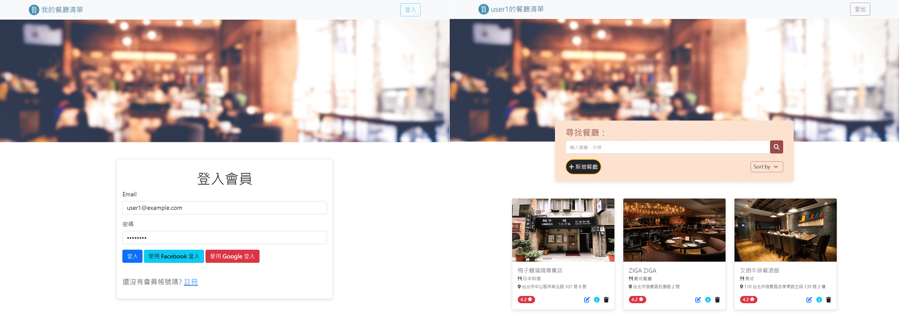

# 我的餐廳清單
登入或註冊會員使用專屬的新增、瀏覽、修改及刪除餐廳，並且可以查看餐廳資訊、搜尋和排序餐廳。



## 功能
* 使用者可以註冊會員並重新登入使用餐廳清單
* 使用者可以登入會員使用餐廳清單
* 使用者可以新增餐廳資訊
* 使用者可以瀏覽自己新增的所有餐廳資訊
* 使用者可以點擊餐廳以取得該餐廳詳細資訊
* 使用者可以修改餐廳資訊
* 使用者可以刪除餐廳資訊
* 使用者可以藉由輸入餐廳名稱或分類的關鍵字來搜尋餐廳
* 使用者可以針對餐廳名稱(英文字母)、分類擊地區進行排序

## 開始使用
1. 請先確認已安裝 node.js 與 npm (版本請見下方開發工具)
2. 經由終端機clone或下載本專案至本地資料夾
  ```
  https://github.com/Noelle-KH/restaurant-list.git
  ```
3. 於終端機進入存放本專案的資料夾
  ```
  cd restaurant-list
  ```
4. 安裝 npm 套件
  ```
  npm install
  ```

5. 新增```.env```檔案，並請根據```.env.example```檔案內資訊設置環境變數

6. 啟動專案前，請先建立種子資料，如在終端機中成功看到done，即表示種子資料建立成功
  ```
  npm run seed
  ```
7. 欲啟動專案，請繼續輸入
  ```
  npm run dev
  ```
8. 若在終端機看到下方訊息代表順利運行，於瀏覽器中輸入該網址([http://localhost:3000](http://localhost:3000))即可開始使用本網站
  ```
  Listening on http://localhost:3000
  ```
9. 如需暫停使用，請於終端機內按下ctrl + c，即可結束


## 開發工具
* node.js 14.16.0
* express 4.16.4
* express-handlebars 3.0.0
* express-session 1.17.1
* mongoose 5.13
* method-override 3.0.0
* dotenv 16.0.3
* bcrypt 2.4.3
* connect-flash 0.1.1
* passport 0.4.1
* passport-local 1.0.0
* passport-facebook 3.0.0
* passport-google-oauth2 0.2.0
* bootstrap 5.1.3
* font awesome 6.2.0
